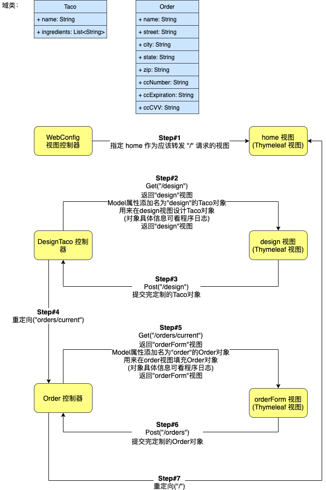

## taco-cloud
一个基于Spring, Spring MVC的墨西哥卷饼外卖平台

## 项目启动
如果没有maven环境，请先配置[maven](https://www.jianshu.com/p/191685a33786)

ps: (如果使用的是zsh，需要正确地在 ~/.zshrc 中 export maven 环境变量以及Java JDK 环境变量)

或使用Homebrew直接安装maven

```aidl
$ brew install maven
```

安装后命令行输入：
```aidl
$ cd taco-cloud
$ mvn spring-boot:run
```

接下来访问 ```localhost:8080```

## 项目概述

[待完善]

## 第1-2章阶段



### 声明验证规则:

在 Spring MVC 中应用验证，需要这样做：

- 对要验证的类声明验证规则：特别是 Taco 类

- 指定验证应该在需要验证的控制器方法中执行，具体来说就是：DesignTacoController 的 processDesign() 方法和 OrderController 的 processOrder() 方法。

- 修改表单视图以显示验证错误。

### 控制器:

- 它们都用 @Controller 进行了注释，以表明它们是控制器类，应该由 Spring 组件扫描自动发现，并在 Spring 应用程序上下文中作为 bean 进行实例化

- 除了 HomeController 之外，所有的控制器都在类级别上使用 @RequestMapping 进行注释，以定义控制器将处理的基本请求模式

- 它们都有一个或多个方法，这些方法都用 @GetMapping 或 @PostMapping 进行了注释，以提供关于哪些方法应该处理哪些请求的细节

### 视图控制器:

- 不填充模型或处理输入

- 只将请求转发给视图的控制器

## 学习总结(2021-03-07)

- Spring 提供了一个强大的 web 框架，称为 Spring MVC，可以用于开发 Spring 应用程序的 web 前端。

- Spring MVC 是基于注解的，可以使用 @RequestMapping、@GetMapping 和 @PostMapping 等注解来声明请求处理方法。

- 大多数请求处理方法通过返回视图的逻辑名称来结束，例如一个 Thymeleaf 模板，请求（以及任何模型数据）被转发到该模板。

- Spring MVC 通过 Java Bean Validation API 和 Hibernate Validator 等验证 API 的实现来支持验证。

- 视图控制器可以用来处理不需要模型数据或处理的 HTTP GET 请求。

- 除了 Thymeleaf，Spring 还支持多种视图选项，包括 FreeMarker、Groovy Templates 和 Mustache

## 第3.1章 使用 JDBC 读写数据


### 为域适配持久化:

- 在将对象持久化到数据库时，通常最好有一个惟一标识对象的字段

- 使用 Lombok (@Data注释) 在运行时自动生成访问器方法，所以除了声明 id 和 createdAt 属性外，不需要做任何事情。它们将在运行时根据需要生成适当的 getter 和 setter 方法。

### 定义 JDBC 存储库

Ingredient repository 需要执行以下操作：

- 查询所有的 Ingredient 使之变成一个 Ingredient 的集合对象

- 通过它的 id 查询单个 Ingredient

- 保存一个 Ingredient 对象

完成了 JdbcIngredientRepository后，现在可以将其注入到 DesignTacoController 中，并使用它来提供一个 Ingredient 对象列表，而不是使用硬编码的值

showDesignForm() 方法的第 2 行现在调用了注入的 IngredientRepository 的 findAll() 方法。findAll() 方法从数据库中提取所有 Ingredient，然后将它们对应到到模型的不同类型中

### 定义schema并预加载数据

- 我们需要 Ingredient 表以及一些保存订单和设计信息的表

- 如果有一个名为 schema.sql 的文件。在应用程序的类路径根目录下执行 sql，然后在应用程序启动时对数据库执行该文件中的 SQL。写入一个名为 schema.sql 的文件中，然后放在项目的 src/main/resources 文件夹下。

- 用一些 Ingredient 数据来预加载数据库。幸运的是，Spring Boot 还将执行一个名为 data.sql 的文件，这个文件位于根路径下。因此，可以使用 src/main/resources/data.sql 中的下面程序清单中的 insert 语句来加载包含 Ingredient 数据的数据库。

### 插入数据

- JdbcIngredientRepository 中的 save() 方法使用 JdbcTemplate 的 update() 方法将 Ingredient 对象保存到数据库中

- dbcTemplate 保存数据的两种方法包括：

    - 直接使用 update() 方法保存一个 Taco
    
        - 保存一个 Taco 设计需要将与该 Taco 关联的 Ingredient 保存到 Taco_Ingredient 表中。同样，保存 Order 也需要将与 Order 关联的 Taco 保存到 Taco_Order_Tacos 表中。这使得保存 Taco 和 Order 比 保存 Ingredient 更有挑战性。
        
        - 这里用了一个不同的 update() 方法，通过使用 PreparedStatementCreator，可以调用 update()，传入 PreparedStatementCreator 和 KeyHolder，返回 Taco id，在 Taco 表中插入一行时，需要知道数据库生成的 id，以便在每个 Ingredient 中引用它。接着插入了 Taco_Ingredient 表。详细实现见[JdbcTacoRepository.java](src/main/java/tacocloud/data/JdbcTacoRepository.java)
           
        - 将 TacoRepository 注入到 DesignTacoController
    
    - 使用 SimpleJdbcInsert 包装类保存一个 Order
    
        - 在保存订单方面，也存在类似的情况。不仅必须将订单数据保存到 Taco_Order 表中，还必须引用 Taco_Order_Tacos 表中的每个 taco
        
        - SimpleJdbcInsert 是一个包装了 JdbcTemplate 的对象，它让向表插入数据的操作变得更容易
        
            - 使用 Jackson 的 ObjectMapper 及其 convertValue() 方法将 Order 转换为 Map
            
            - 使用 executeAndReturnKey() 将订单信息保存到 Taco_Order 表中，并将数据库生成的 id 作为一个 Number 对象返回
            
            - 使用 execute() 存储 Taco 映对 Taco_Order 的信息到 Taco_Order_Tacos 表中 
            
- 这里有个需要注意的重点就是：

    设计完 Taco 后，我们使用注入的 TacoRepository 来保存这个 Taco 对象到 Taco 表以及 Taco_Ingredient 表中，然后将 Taco 对象添加到保存于 session 中 Order 对象中，Order 对象仍然保留在 session 中，直到用户完成并提交 Order 表单才会保存到数据库中。其中 Order 对象在被提交保存到数据库前应该保存在会话中的并且可以跨多个请求使用。@SessionAttributes("order") 指定了这一点。
    
## 第3.2章 使用 Spring Data JPA 持久化数据

Spring Data JPA帮你做了一切，包括了常见api的实现，数据库schema的实现，全部自动化完成


### 注解域作为实体

- 为了将其声明为 JPA 实体，必须使用 @Entity 注解

- id 属性必须使用 @Id 进行注解

- Taco 类因为依赖于数据库自动生成 id 值，所以还使用 @GeneratedValue 注解 id 属性，指定自动策略

- 要声明 Taco 及其相关 Ingredient 列表之间的关系，可以使用 @ManyToMany 注解 ingredient 属性。一个 Taco 可以有很多 Ingredient，一个 Ingredient 可以是很多 Taco 的一部分。

- Order 类级别有一个新的注解：@Table。这指定订单实体应该持久化到数据库中名为 Taco_Order 的表中。尽管可以在任何实体上使用这个注解，但它对于 Order 是必需的。没有它，JPA 将默认将实体持久化到一个名为 Order 的表中，但是 Order 在 SQL 中是一个保留字，会导致问题

### 声明 JPA repository

- 在存储库的 JDBC 版本中，显式地声明了希望 repository 提供的方法。但是使用 Spring Data，扩展 CrudRepository 接口

- CrudRepository 为 CRUD（创建create、读取read、更新update、删除delete）操作声明了十几个方法

- 有了三个 repository，可能认为需要为这三个 repository 编写实现，还包括每种实现的十几个方法。但这就是 Spring Data JPA 优秀的地方 —— 不需要编写实现

- 当应用程序启动时，Spring Data JPA 会动态地自动生成一个实现。这意味着 repository 可以从一开始就使用。只需将它们注入到控制器中

- CrudRepository 提供的方法非常适合用于实体的通用持久化

### 自定义 JPA repository

- 在生成 repository 实现时，Spring Data 检查存储库接口中的任何方法，解析方法名称，并尝试在持久化对象的上下文中理解方法的用途（在本例中是 Order）。本质上，Spring Data 定义了一种小型的领域特定语言（DSL），其中持久化细节用 repository 中的方法签名表示 

## 学习总结(2021-03-18)

- 使用 JDBC 读写数据，JdbcTemplate 大大简化了 JDBC 的工作。

- dbcTemplate 用两种不同的 update() 方法来保存数据，当需要知道数据库生成的 id 时，可以同时使用 PreparedStatementCreator 和 KeyHolder。

- dbcTemplate 还可以为了方便执行数据插入，使用 SimpleJdbcInsert。

- Spring Data JPA 使得 JPA 持久化就像编写存储库接口一样简单。

## 第4章 Spring Security

- 提示使用登录页面进行身份验证，而不是使用 HTTP 基本对话框。

- 为多个用户提供注册页面，让新的 Taco Cloud 用户可以注册。

- 为不同的请求路径应用不同的安全规则。例如，主页和注册页面根本不需要身份验证。

### 配置一个能够处理多个用户的用户存储

Spring Security 为配置用户存储提供了几个选项: 

- 一个内存(in-memory)用户存储

- 基于 JDBC 的用户存储

- 由 LDAP 支持的(LDAP-backed)用户存储

- 定制用户详细信息服务(a custom user details service)

通过重写 WebSecurityConfigurerAdapter 配置基类中定义的 configure() 方法来配置你选择的用户存储

### 内存用户存储

- 内存中的用户存储应用于测试或非常简单的应用程序时非常方便，但是它不允许对用户进行简单的编辑。如果需要添加、删除或更改用户，则必须进行必要的更改，然后重新构建、部署应用程序。

- 对于 Taco Cloud 应用程序，由于内存中用户存储的闲置，因此希望客户能够注册应用程序并管理自己的用户帐户，这不能够实现。

### 基于 JDBC 的用户存储

- 用户信息通常在关系数据库中维护，基于 JDBC 的用户存储似乎比较合适

- 重写默认用户查询：Spring Security 内部有在查找用户详细信息时将执行的 SQL 查询，但需要对查询进行更多的控制。在这种情况下，可以配置自己的查询。
    
  ```
    - usersByUsernameQuery(*sql语句) // 身份验证查询
    
    - authoritiesByUsernameQuery(*sql语句) // 基本授权查询
    
    - groupAuthoritiesByUsername(*sql语句) // 组权限查询
  ```
  
  在将默认 SQL 查询替换为自己设计的查询时，一定要遵守查询的基本约定。它们都以用户名作为唯一参数。身份验证查询选择用户名、密码和启用状态；授权查询选择包含用户名和授予的权限的零个或多个行的数据；组权限查询选择零个或多个行数据，每个行有一个 group id、一个组名和一个权限。
  
- 使用编码密码

    - 通过调用 passwordEncoder() 方法指定一个密码编码器
    
    - passwordEncoder() 方法接受 Spring Security 的 passwordEncoder 接口的任何实现。Spring Security 的加密模块包括几个这样的实现：
        
        - BCryptPasswordEncoder —— 采用 bcrypt 强哈希加密
        - NoOpPasswordEncoder —— 不应用任何编码
        - Pbkdf2PasswordEncoder —— 应用 PBKDF2 加密
        - SCryptPasswordEncoder —— 应用了 scrypt 散列加密
        - StandardPasswordEncoder —— 应用 SHA-256 散列加密
        
    - 用户在登录时输入的密码使用相同的算法进行编码，然后将其与数据库中编码的密码进行比较。比较是在 PasswordEncoder 的 matches() 方法中执行的。
    
### 自定义用户身份验证

- 创建表示和持久存储用户信息的域对象

    - 定义用户实体 User: 用户名和密码、全名、地址和电话号码
    
    - 这里的 User 类实现了 UserDetails 接口，向框架提供一些基本的用户信息，比如授予用户什么权限以及用户的帐户是否启用
    
    - getAuthorities() 方法应该返回授予用户的权限集合。各种 isXXXexpired() 方法返回一个布尔值，指示用户的帐户是否已启用或过期。
    
    - 现在，Taco Cloud 还不需要禁用用户，所以所有的 isXXXexpired() 方法都返回 true 来表示用户处于活动状态
    
- 自定义 User JPA repository 存储库接口
    
    - 除了 CrudRepository 提供的基本 CRUD 操作之外，还可以自定义 JPA repository，在生成 repository 实现时，Spring Data 检查存储库接口中的任何方法，解析方法名称，并尝试在持久化对象的上下文中理解方法的用途。本质上，Spring Data 定义了一种小型的领域特定语言（DSL），其中持久化细节用 repository 中的方法签名表示。
    
    - 除了通过扩展 CrudRepository 提供的 CRUD 操作之外，UserRepository 还定义了一个 findByUsername() 方法，将在用户详细信息服务中使用该方法根据用户名查找 User。
    
- 编写使用此存储库的自定义用户详细信息服务

    - 